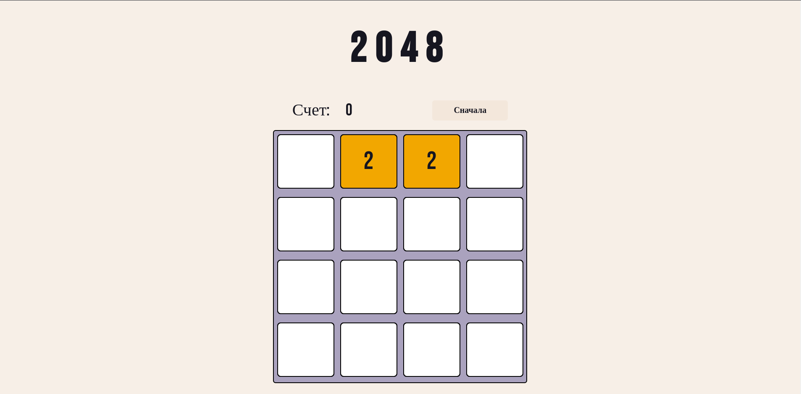

# Web_2048

## Описание:
2048 — браузерная игра.
Игровое поле имеет форму квадрата 4x4. 
## Цель: 
Целью игры является получение плитки номинала «2048» (при желании можно продолжить дальше).

## Стек:
> Html

> Css

> Js

